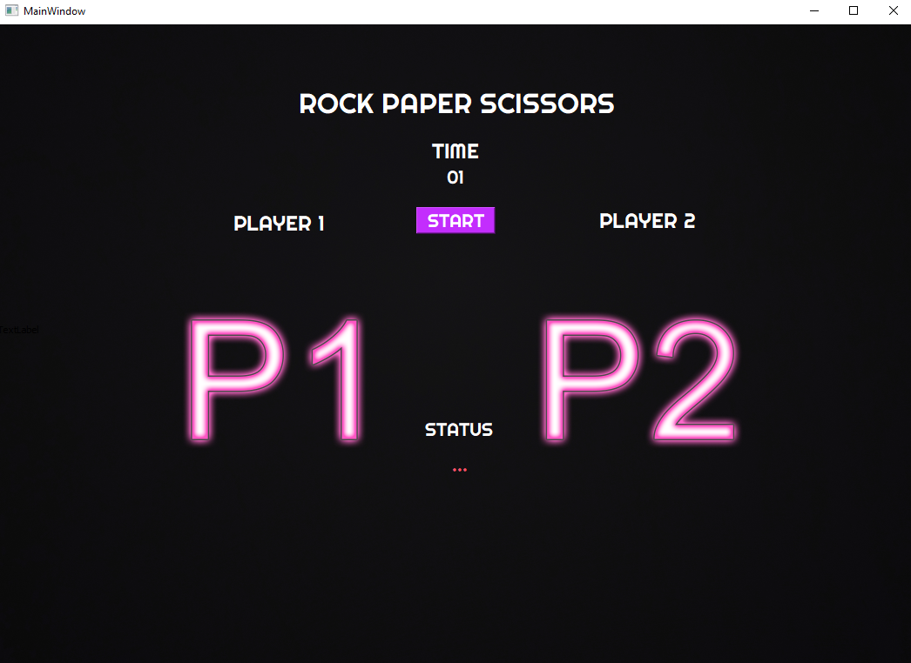

# rock-paper-scissors

This Rock Paper Scissors game can be played with a breadboard with 2 switches. And it has a nice PyQt5 UI. It is built on the Arduino UNO development board.

## 📸 Screenshot

